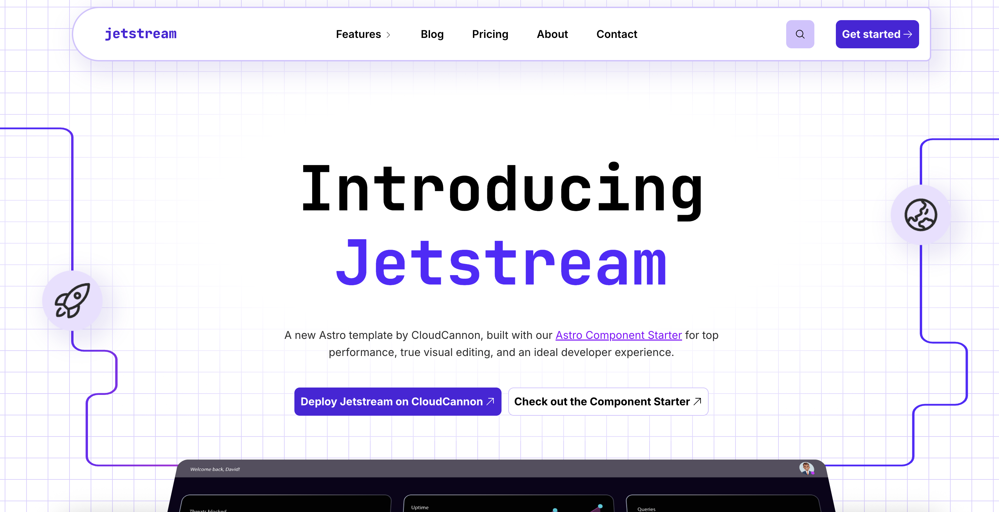

# Jetstream

Jetstream is a polished, high-performance marketing website template for Astro. Browse through a [live demo](https://crawling-submarine.cloudvent.net/).



[](https://app.cloudcannon.com/register#sites/connect/github/cloudcannon/jetstream-astro-template)

## Features

- **Modern Architecture**: Built with Astro for optimal performance and minimal JavaScript
- **Visual Editing**: Visual editing with [CloudCannon](https://cloudcannon.com/) editable regions - edit directly on the pages
- **Component Library**: Reusable, componentized architecture for better maintainability
- **Image Optimization**: Astro's built-in image optimization for all images
- **Accessibility**: Fully accessible navigation and components
- **Design Tokens**: CSS variables for consistent theming
- **Blog System**: Complete blog with pagination and category pages
- **SEO Optimized**: Pre-configured for search engine optimization

## Setup

1. Get a workflow going to see your site's output (with [CloudCannon](https://app.cloudcannon.com/)
   or Astro locally).

### Local Development

Jetstream is built with [Astro](https://astro.build/) and modern CSS for a lean, performant development experience.

```bash
npm install
npm run dev
```

## Site Details

### Tech Stack

- **Astro**: Static site generation with component islands architecture
- **CSS**: Modern CSS with custom properties and cascade layers
- **Lightning CSS**: Fast CSS processing and optimization
- **TypeScript**: Type-safe component development

## Editing

Jetstream features advanced visual editing capabilities with CloudCannon's split configuration, allowing for intuitive content management and real-time preview.

### Visual Editing

- **Live Preview**: See changes instantly as you edit
- **Component-based**: Edit reusable components directly in context
- **Split Configuration**: Modern CloudCannon setup for enhanced editing experience

### Content Management

#### Posts

- Add, update or remove posts in the _Posts_ collection
- Automatic pagination and category organization
- Rich content editing with live preview

#### Site Configuration

- **SEO**: Centralized company information reused across the site
- **Navigation**: Fully accessible, responsive navigation management
- **Footer**: Configurable footer elements and links

## Multilingual

The site is built in English, then [Rosey](https://rosey.app/) produces the French and German copies after the Astro build. English is served at the root, with the other languages under `/fr/` and `/de/`. Translations are edited in CloudCannon's Visual Editor by the [Rosey CloudCannon Connector](https://rosey.cc/) (RCC).

### The pipeline

`.cloudcannon/postbuild` runs four steps:

1. `rosey generate` — scans the built HTML for `data-rosey` keys into `rosey/base.json`
2. `rosey-cloudcannon-connector write-locales` — syncs those keys into `rosey/locales/{fr,de}.json` and writes the locale manifest the browser client fetches
3. `rosey build` — writes the translated copies of the site
4. `pagefind` — indexes last, so each locale gets its own search index

**CloudCannon needs `CLOUDCANNON_SYNC_PATHS=/rosey/`** so the files generated during the build are committed back. It's preset in `.cloudcannon/initial-site-settings.json` for new sites; existing sites need it added in their site settings. Without it, translations are lost on every build.

### How content gets keys

Keys are **derived from the `data-prop` attributes** the building blocks already emit for inline editing (`src/components/utils/roseyKey.ts`) — so tagging a new component usually means nothing extra. Each page-builder block namespaces its own keys with its `_uuid`, giving keys like `about:9c1e…:heading` that survive reordering.

- `data-rosey={false}` at a call site opts a value out (names, prices, post frontmatter).
- Nav and footer links use their own text as the key, under a `nav:` / `footer:` namespace, so the desktop and mobile menus share one translation each.
- Tag labels live under a shared `tags:` root, so a label is translated once for the listing, the tag page and the post breadcrumb. Tag slugs stay in English — only labels translate.
- `<title>` and the meta description are opt-in per route via a `roseySeo` prop on the layout. They aren't on the page, so they're only reachable through the **Locales** collection.

### What isn't translated

Blog post bodies and frontmatter stay in the default language, so post pages set `hideLocaleSwitcher` and the connector hides its switcher there. The blog listing keeps its switcher, because its headings and tag chips *are* keyed — post titles in the cards stay English by design. Structured data (JSON-LD) and Open Graph tags are also left untranslated.

### Adding a language

1. Add the code to `locales` in `src/components/utils/locales.ts`
2. Add it to `--locales` in `.cloudcannon/postbuild`
3. Add a `data_config.locales_<code>` entry in `cloudcannon.config.yml`

For more details on the component architecture and development workflow, view the [Astro Component Starter README](https://github.com/CloudCannon/astro-component-starter).
